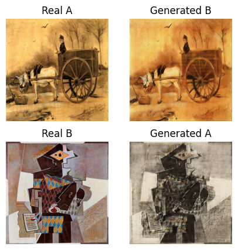
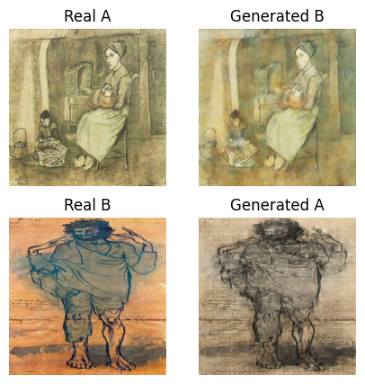
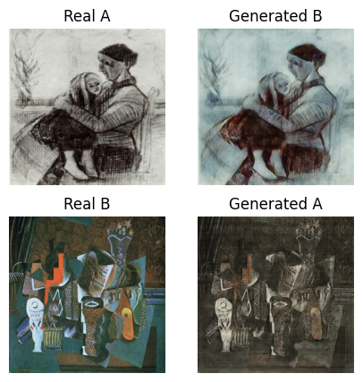
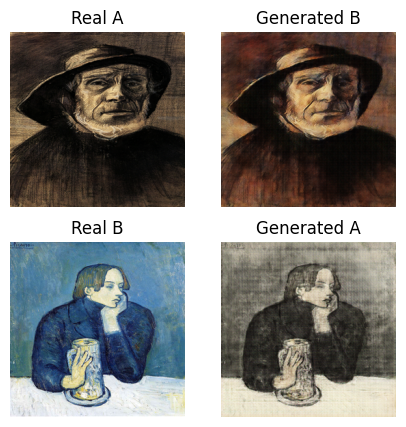

# ArtGAN: Art Style Transfer with Self-Attention Generative Adversarial Networks

This repository contains the implementation of ArtGAN, a novel Generative Adversarial Network (GAN) architecture that leverages self-attention mechanisms for efficient art style transfer. By incorporating the attention mechanism in the generator network, our method enables the model to focus on relevant features in the input image and generate high-quality stylized output. We demonstrate the effectiveness of our approach using two prominent artists, Vincent van Gogh and Pablo Picasso, and evaluate the model performance on their respective datasets. Experimental results show that ArtGAN outperforms the CycleGAN model without attention in terms of visual quality and style transfer fidelity, illustrating the effectiveness of incorporating attention mechanisms in the style transfer process.

## Key Features
* Self-attention mechanism for capturing global context within the input image.
* Attention-based generator network for improved content preservation and effective style transfer.
* Domain classifier in the discriminator network to address the domain adaptation problem.

## Motivation
Art style transfer has become a popular research topic in the field of computer vision, with numerous applications in content generation, digital art, and entertainment. Recent advances in deep learning, particularly GANs, have shown promising results in generating realistic images and transferring artistic styles between different domains. However, conventional GAN architectures often struggle to capture fine-grained details and preserve the essence of the input image while transferring the desired style.

ArtGAN addresses these challenges by incorporating a self-attention mechanism to selectively focus on relevant features and suppress irrelevant ones, thus allowing for improved content preservation and more effective style transfer. The attention mechanism plays a crucial role in refining the generated images by selectively emphasizing important regions and suppressing irrelevant information, resulting in improved preservation of content and better incorporation of the target artistic style.

## Experiments
We evaluate our proposed method on two different datasets, featuring artworks from Vincent van Gogh and Pablo Picasso. Our experiments show that ArtGAN outperforms baseline methods, including CycleGAN, in terms of visual quality and style transfer fidelity, demonstrating the effectiveness of the attention mechanism in the context of art style transfer. Furthermore, the attention mechanism's ability to adapt to various artistic styles highlights its versatility and potential applicability to a wide range of art domains.

 
 
